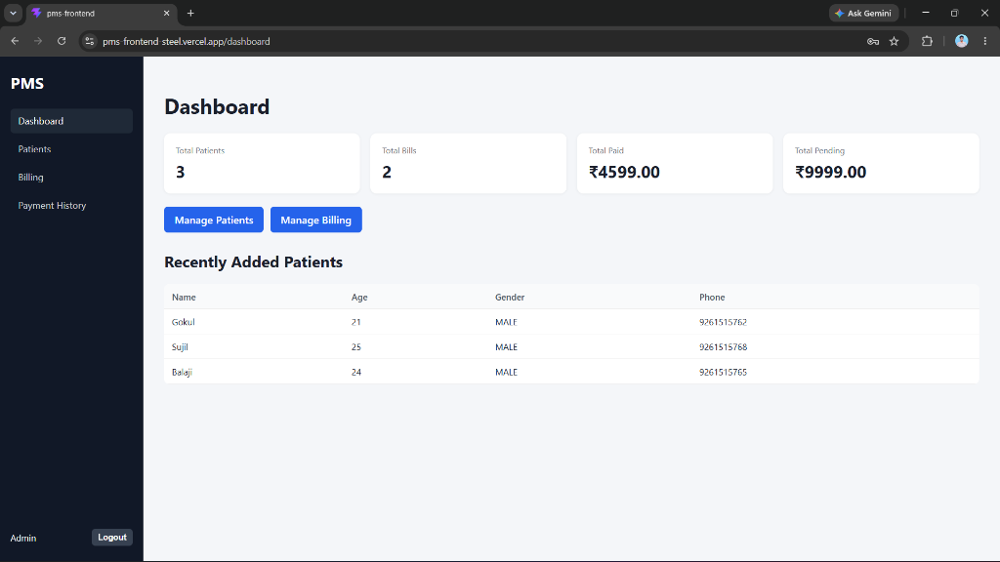
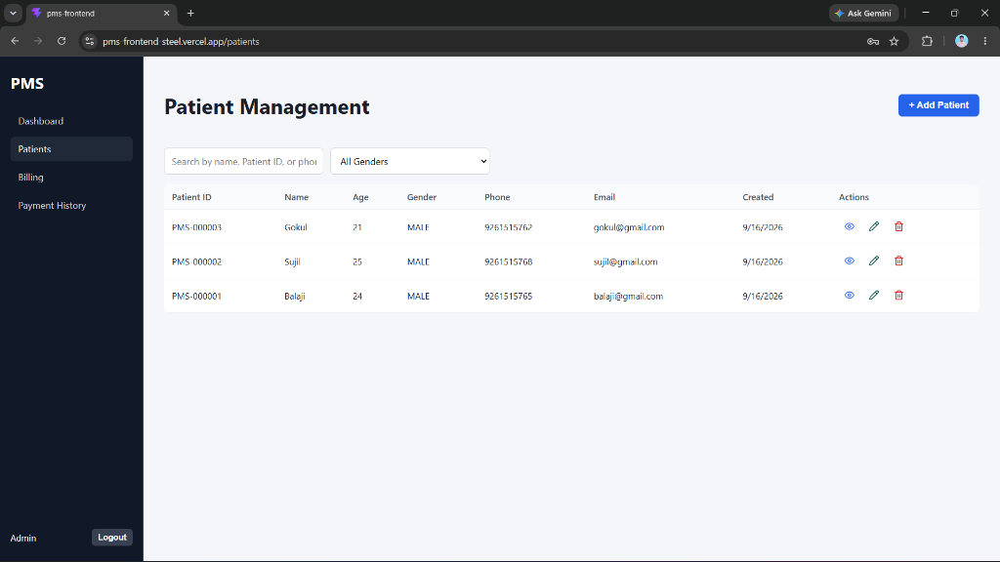
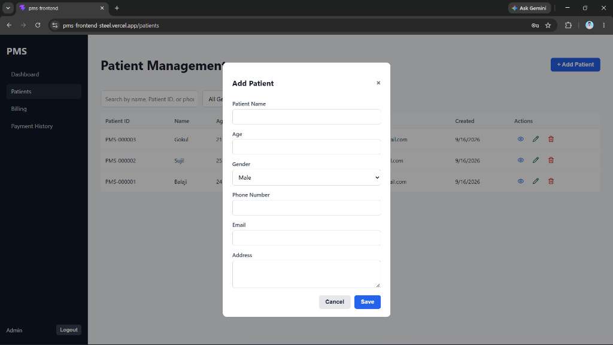

# 🏥 Patient Management System

A full-stack web application for managing patients, billing, and payments — built with **NestJS**, **PostgreSQL**, **React**, and **Redux Toolkit**, deployed on **Vercel** with **Neon** as the cloud database.

## 🔗 Live Demo

| Service | URL |
|---------|-----|
| **Frontend** | https://pms-frontend-steel.vercel.app |
| **Backend API** | https://pms-blush-rho.vercel.app |

**Login credentials:**
- Email: `admin@pms.com`
- Password: `Admin@123`

---

## 📸 Screenshots

### Dashboard


### Patient Management


### Add Patient Form


---

## 🧱 Tech Stack

| Layer | Technology |
|-------|-----------|
| Frontend | React 19, Redux Toolkit, React Router v6, Axios, Lucide React |
| Backend | NestJS 10, TypeORM, Passport JWT, bcrypt |
| Database | PostgreSQL (Neon cloud / local) |
| Payments | Razorpay |
| Deployment | Vercel (frontend + backend serverless), Neon (PostgreSQL) |
| Build Tool | Vite (frontend), Nest CLI (backend) |

---

## 📁 Project Structure

```
patient-management-system/
├── pms-frontend/          # React + Vite SPA
│   ├── src/
│   │   ├── api/           # Axios client + Razorpay loader
│   │   ├── app/           # Redux store
│   │   ├── components/    # Shared UI components (Modal, forms, layout)
│   │   ├── features/      # Redux slices (auth, patients, bills, payments, dashboard)
│   │   ├── pages/         # Route-level screens
│   │   └── routes/        # ProtectedRoute guard
│   ├── vercel.json        # SPA routing — serves index.html for all routes
│   └── .env.example
│
└── pms-backend/           # NestJS REST API
    ├── src/
    │   ├── entities/      # TypeORM entities: User, Patient, Bill, Payment
    │   ├── auth/          # Login, JWT strategy, JwtAuthGuard
    │   ├── patients/      # Patient CRUD + search/filter
    │   ├── bills/         # Billing CRUD
    │   ├── payments/      # Razorpay order creation + signature verification
    │   ├── dashboard/     # Aggregated summary stats
    │   └── common/        # Global exception filter, response interceptor
    ├── api/
    │   └── index.ts       # Vercel serverless entry point (wraps NestJS app)
    ├── scripts/
    │   └── seed-user.ts   # Seeds admin user into the database
    ├── vercel.json        # Routes all requests to api/index.ts
    └── .env.example
```

---

## 🚀 Local Development

### Prerequisites
- Node.js 18+
- PostgreSQL running locally

### 1. Clone the repository
```bash
git clone https://github.com/darkk-shadow/pms.git
cd patient-management-system
```

### 2. Setup the Backend
```bash
cd pms-backend

# Install dependencies
npm install

# Configure environment
cp .env.example .env
# Edit .env with your local DB credentials and Razorpay TEST keys

# Start the backend (auto-creates tables via synchronize: true)
npm run start:dev
```

### 3. Seed the Admin User
Run this **once** after the backend starts (tables are auto-created on first boot):
```bash
npx ts-node scripts/seed-user.ts
```

### 4. Setup the Frontend
```bash
cd ../pms-frontend

# Install dependencies
npm install

# Configure environment
cp .env.example .env
# Set VITE_API_URL=http://localhost:3000

# Start the dev server
npm run dev
```

### 5. Open the app
Visit **http://localhost:5173** and login with:
- Email: `admin@pms.com`
- Password: `Admin@123`

---

## ⚙️ Environment Variables

### Backend (`pms-backend/.env`)

| Variable | Description | Example |
|----------|-------------|---------|
| `DB_HOST` | PostgreSQL host | `localhost` |
| `DB_PORT` | PostgreSQL port | `5432` |
| `DB_USERNAME` | DB username | `postgres` |
| `DB_PASSWORD` | DB password | `yourpassword` |
| `DB_NAME` | Database name | `pms_db` |
| `JWT_SECRET` | Secret for signing JWTs | `a-long-random-string` |
| `RAZORPAY_KEY_ID` | Razorpay TEST key ID | `rzp_test_xxx` |
| `RAZORPAY_KEY_SECRET` | Razorpay TEST secret | `your_secret` |
| `FRONTEND_URL` | Frontend origin for CORS | `http://localhost:5173` |
| `PORT` | Server port | `3000` |
| `NODE_ENV` | Environment | `production` |

### Frontend (`pms-frontend/.env`)

| Variable | Description | Example |
|----------|-------------|---------|
| `VITE_API_URL` | Backend base URL | `http://localhost:3000` |

---

## 🌐 API Endpoints

All routes except login require `Authorization: Bearer <token>`.

| Method | Endpoint | Description |
|--------|----------|-------------|
| `POST` | `/api/auth/login` | Login, returns JWT |
| `GET` | `/api/patients` | List all patients (with search/filter) |
| `POST` | `/api/patients` | Create a patient |
| `GET` | `/api/patients/:id` | Get patient by ID |
| `PATCH` | `/api/patients/:id` | Update patient |
| `DELETE` | `/api/patients/:id` | Delete patient |
| `GET` | `/api/bills` | List all bills |
| `POST` | `/api/bills` | Create a bill |
| `GET` | `/api/bills/:id` | Get bill by ID |
| `PATCH` | `/api/bills/:id` | Update bill |
| `DELETE` | `/api/bills/:id` | Delete bill |
| `POST` | `/api/payments/create-order` | Create Razorpay order |
| `POST` | `/api/payments/verify` | Verify payment signature |
| `GET` | `/api/payments` | List all payments |
| `GET` | `/api/payments/bill/:billId` | Get payment for a bill |
| `GET` | `/api/dashboard/summary` | Dashboard stats |

**Response shape:**
```json
// Success
{ "success": true, "data": { ... } }

// Error
{ "success": false, "statusCode": 400, "message": "...", "timestamp": "..." }
```

---

## 💳 Razorpay Payment Flow

```
1. User clicks "Pay Bill"
2. Frontend → POST /api/payments/create-order { billId }
3. Backend creates Razorpay order server-side (secret key never leaves backend)
4. Backend returns { orderId, amount, currency, keyId }
5. Frontend opens Razorpay Checkout modal
6. User completes payment
7. Razorpay returns { razorpay_payment_id, razorpay_signature } to frontend
8. Frontend → POST /api/payments/verify with those values
9. Backend verifies HMAC-SHA256 signature and marks bill as PAID
10. Frontend Redux store updates immediately — badge reflects PAID status
```

---

## 🗄️ Data Flow

```
Component
  └─► dispatch(thunk)
        └─► apiClient (axios + JWT)
              └─► NestJS REST API
                    └─► TypeORM
                          └─► PostgreSQL (Neon)
                    └─► response
              └─► slice reducer (pending → fulfilled/rejected)
        └─► Redux store updates
  └─► Component re-renders with new state
```

---

## ☁️ Deployment (Vercel + Neon)

### Architecture
```
Browser
  │
  ▼
Vercel — Frontend (pms-frontend)
  React + Vite SPA | vercel.json rewrites → index.html
  │
  │ API calls (VITE_API_URL)
  ▼
Vercel — Backend (pms-backend)
  NestJS Serverless | api/index.ts → @vercel/node
  │
  │ TypeORM + SSL
  ▼
Neon — PostgreSQL (cloud database)
```

### How the Backend Serverless Works

The file [`api/index.ts`](pms-backend/api/index.ts) wraps the NestJS app as a Vercel serverless function:
- `@vercel/node` compiles it directly from TypeScript — no pre-build step needed
- The NestJS app is **cached across warm invocations** to minimize cold-start time
- All HTTP requests are forwarded to the Express adapter inside NestJS

### Key Deployment Notes

- **SSL**: TypeORM uses `ssl: { rejectUnauthorized: false }` in production for Neon compatibility
- **CORS**: Backend accepts requests from any `*.vercel.app` origin (covers both production and preview deployments) plus `localhost:5173`
- **Tables**: Created automatically via `synchronize: true` on first boot
- **Admin user**: Seeded via `scripts/seed-user.ts`

### Deploy Your Own

1. **Create a Neon database** at [neon.tech](https://neon.tech)
2. **Fork this repo** and push to GitHub
3. **Deploy backend** on Vercel → Root Directory: `pms-backend`
4. **Add backend env vars** (DB credentials, JWT_SECRET, Razorpay keys, FRONTEND_URL)
5. **Deploy frontend** on Vercel → Root Directory: `pms-frontend`
6. **Add** `VITE_API_URL=https://your-backend.vercel.app` to frontend env vars
7. **Update** `FRONTEND_URL` in backend env vars to your frontend URL
8. **Seed admin user**:
   ```bash
   # Set Neon credentials in pms-backend/.env, then:
   cd pms-backend
   npx ts-node scripts/seed-user.ts
   ```

---

## 🔒 Security Notes

- Passwords are hashed with **bcrypt** (10 rounds) — never stored in plaintext
- JWT tokens are signed server-side and verified on every protected request
- Razorpay **secret key** never reaches the frontend — only the public `keyId`
- Payment signatures are verified server-side using **HMAC-SHA256**
- CORS restricts origins to the configured frontend URL and Vercel preview URLs only
- `.env` files are gitignored — never committed to the repository